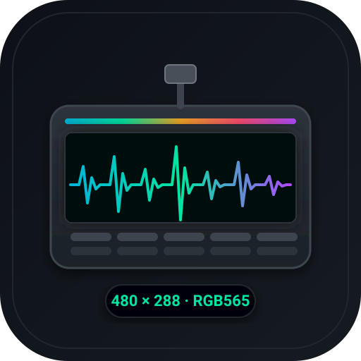
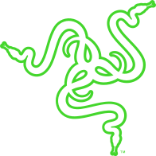

<p align="center">
  
</p>

<p align="center">
  
  &nbsp;&nbsp;
  
</p>

<h1 align="center">SignalRGB plugin per Razer Stream Controller X</h1>

<p align="center">
  <strong>Full 480 × 288 native resolution, no logo overlay, bilingual IT/EN documentation.</strong>
</p>

---

<table>
<tr><td align="center"><a href="docs/INSTALL-IT.md"><strong>🇮🇹 Installazione</strong></a></td>
    <td align="center"><a href="docs/INSTALL-EN.md"><strong>🇬🇧 Installation</strong></a></td>
    <td align="center"><a href="#prestazioni--performance">Prestazioni</a></td>
    <td align="center"><a href="#come-funziona--how-it-works">Come funziona</a></td></tr>
</table>

## Cos'è

Il Razer Stream Controller X ha uno schermo LCD 480 × 288 dietro a 15 tasti
5 × 3. Questo plugin legge l'effetto attivo in SignalRGB e lo trasferisce sul
display del deck, pixel per pixel, in RGB565.

**Non usa `LCD.getFrame()`.** Quel percorso restituisce il frame composited di
SignalRGB, con l'overlay del face/logo disegnato al centro, e non si può
rimuovere. Il plugin legge invece il canvas dell'effetto con `device.color()`,
così il risultato è pulito e a piena qualità.

## In azione

Il plugin in funzione sul deck, con l'effetto di SignalRGB letto dal canvas e
scritto sul display a 480 × 288.

<p align="center">
<a href="https://raw.githubusercontent.com/StargateLabs/signalrgb-razer-stream-controller-x/main/assets/demo.mp4">

</a>
<br>
<a href="https://raw.githubusercontent.com/StargateLabs/signalrgb-razer-stream-controller-x/main/assets/demo.mp4"><b>▶ Guarda il video completo (23 secondi)</b></a>
</p>

## Prestazioni / Performance

Misurate su questo device, con gli script in `assets/`:

| Configurazione | fps |
|---|---|
| **Plugin via SignalRGB** | **3,6 – 4,6** |
| pyserial diretto, 8 frame in coda | 12,8 |
| Bridge standalone pyserial | 20,8 |

Il limite non è il plugin: è il trasporto interno di SignalRGB, misurato in
2,3 – 2,5 MB/s contro gli 11,5 MB/s che pyserial ottiene sugli stessi byte
dallo stesso cavo.

| Measured | Value |
|---|---|
| SignalRGB `Serial.write` | 2,3 – 2,5 MB/s |
| pyserial, same bytes | 11,5 MB/s |
| Device refresh cycle | ~420 ms (fixed, does not scale with bytes) |
| Frame queue depth used | 8 |

## Come funziona / How it works

Protocollo Loupedeck (WebSocket-over-serial), handshake `HTTP/1.1 101`.

```
FRAMEBUFF  0x10   pixel di un rettangolo
DRAW       0x0f   mostra il framebuffer
VERSION    0x07   versione firmware
SERIAL     0x03   keep-alive
```

Ogni tasto da 96 × 96 costa 18.459 byte. Il plugin scrive solo i tasti cambiati,
con una soglia di tolleranza sul rumore di dither, e mantiene una coda di frame
allineata al ciclo di refresh del device.

Protezioni: `BUDGET_BYTES` più grande del frame intero, così un push è sempre
completo o assente, mai parziale. Senza, si vedrebbero strisce.

## Installazione

Copia `plugin/Razer_Stream_Controller_X.js` in:

```
%LOCALAPPDATA%\VortxEngine\app-<VERSIONE>\Signal-x64\Plugins\Razer\
```

Poi riavvia SignalRGB.

> Synapse e Loupedeck non devono essere in esecuzione.

Guida completa: [IT](docs/INSTALL-IT.md) · [EN](docs/INSTALL-EN.md)

## Documentazione tecnica

Le misure, il protocollo, la curva di costo per write e i limiti verificati:

- [TECHNICAL-IT.md](docs/TECHNICAL-IT.md)
- [TECHNICAL-EN.md](docs/TECHNICAL-EN.md)

## Struttura

```
plugin/Razer_Stream_Controller_X.js   il plugin
docs/INSTALL-IT.md                   installazione, italiano
docs/INSTALL-EN.md                   installation, english
docs/TECHNICAL-IT.md                 protocollo, misure, limiti
docs/TECHNICAL-EN.md                 technical notes
assets/icon.svg, icon.png           icona del progetto
assets/product.png                  foto del prodotto
assets/brand/                        logo ufficiali SignalRGB e Razer
assets/measure-*.py                  script di misura (richiedono SignalRGB chiuso)
assets/demo.gif                      animazione di funzionamento
assets/demo.mp4                       video completo, 23 secondi
assets/demo-poster.jpg                still del video
```

## Crediti e licenze

Protocollo e riferimenti:

- [foxxyz/loupedeck](https://github.com/foxxyz/loupedeck), protocollo seriale e costanti dei comandi
- [scottlaird/loupedeck](https://github.com/scottlaird/loupedeck), conferma indipendente del ciclo di refresh
- [Razer Stream Controller X](https://www.razer.com/pc/content-creation/controllers/razer-stream-controller-x), scheda prodotto ufficiale

I loghi SignalRGB e Razer appartengono ai rispettivi proprietari e sono usati
solo per identificare l'hardware e il software a cui il plugin si riferisce.

## Licenza

MIT, vedi [LICENSE](LICENSE).

---

<p align="center">
  <strong>Created by <a href="https://github.com/StargateLabs">Stargate Labs</a></strong>
</p>
